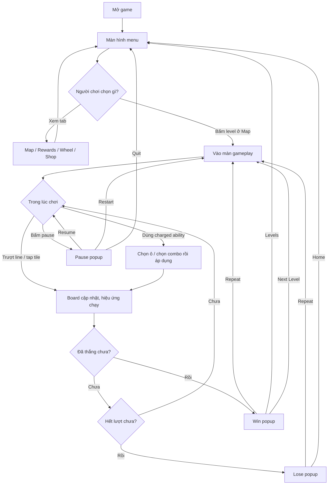

# Game Flow

Tài liệu này mô tả luồng game hiện tại theo code trong project.

Nguồn chính:
- `AppBootstrap`
- `GameAppFlowManager`
- `GameFlowManager`
- `Match3LevelManager`
- `Match3GameManager`
- `MapSubScreen`
- `GameplayScreen`
- `PausePopup`
- `WinPopup`
- `LosePopup`

## Flowchart

Phiên bản này chỉ giữ luồng mà người chơi nhìn thấy trên màn hình và các hành động họ có thể bấm.

## Ghi chú

- Đây là bản đơn giản hóa theo góc nhìn người chơi, không show manager, bootstrap hay state nội bộ.
- `Next Level` trên `WinPopup` hiện đang hoạt động như `Repeat`, tức là quay lại gameplay của level hiện tại.
